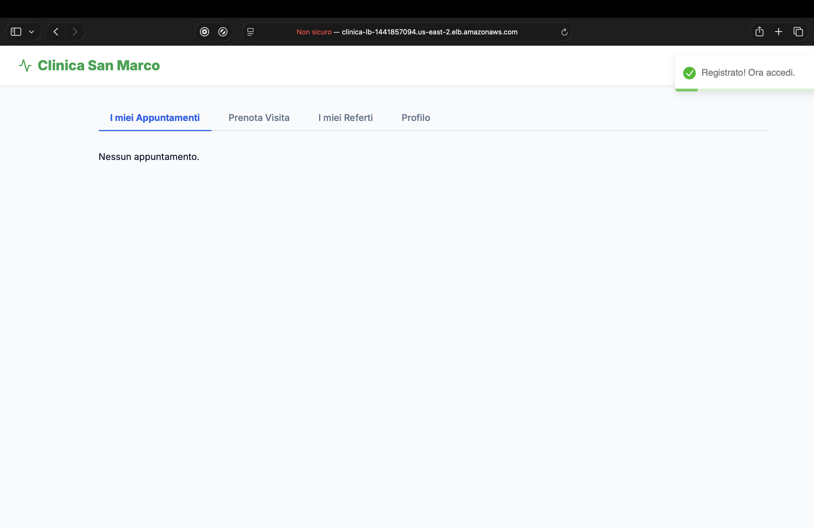
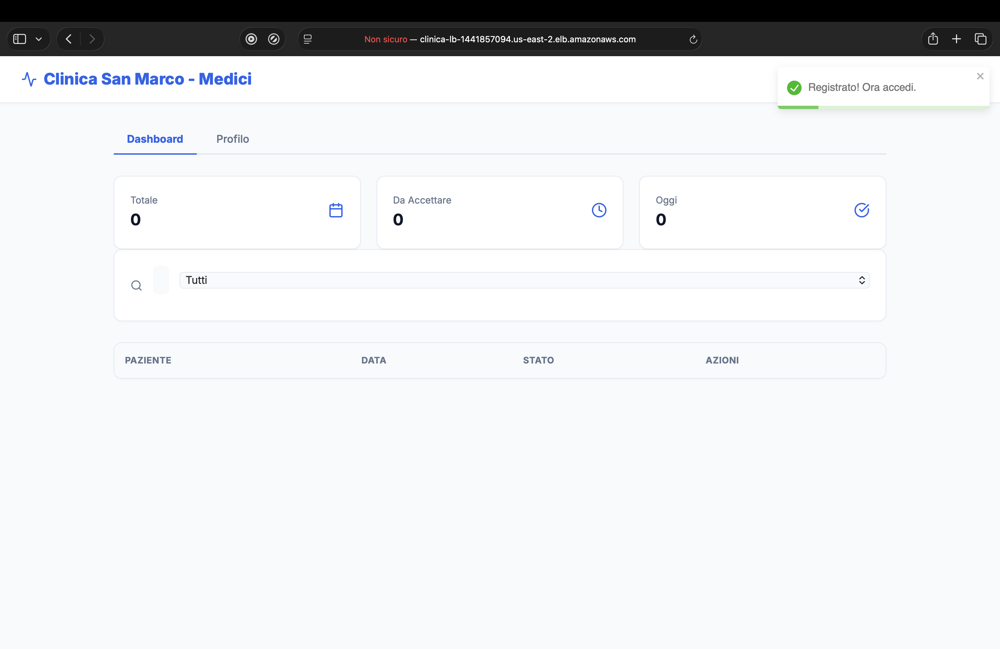
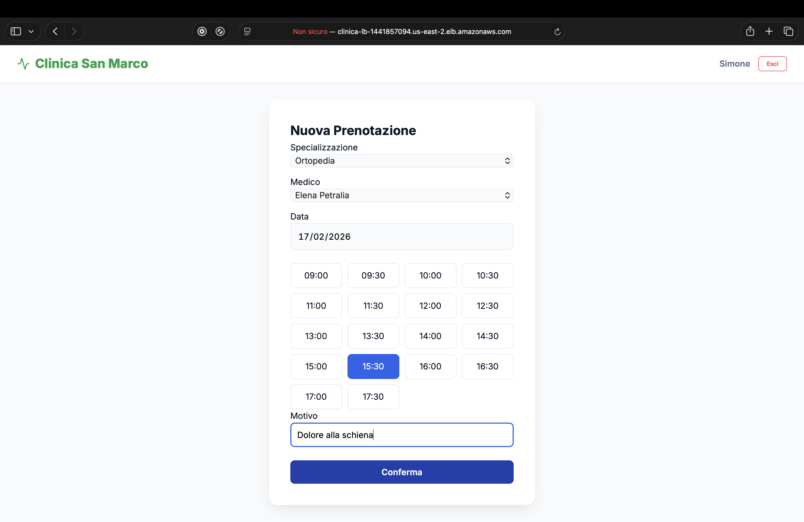
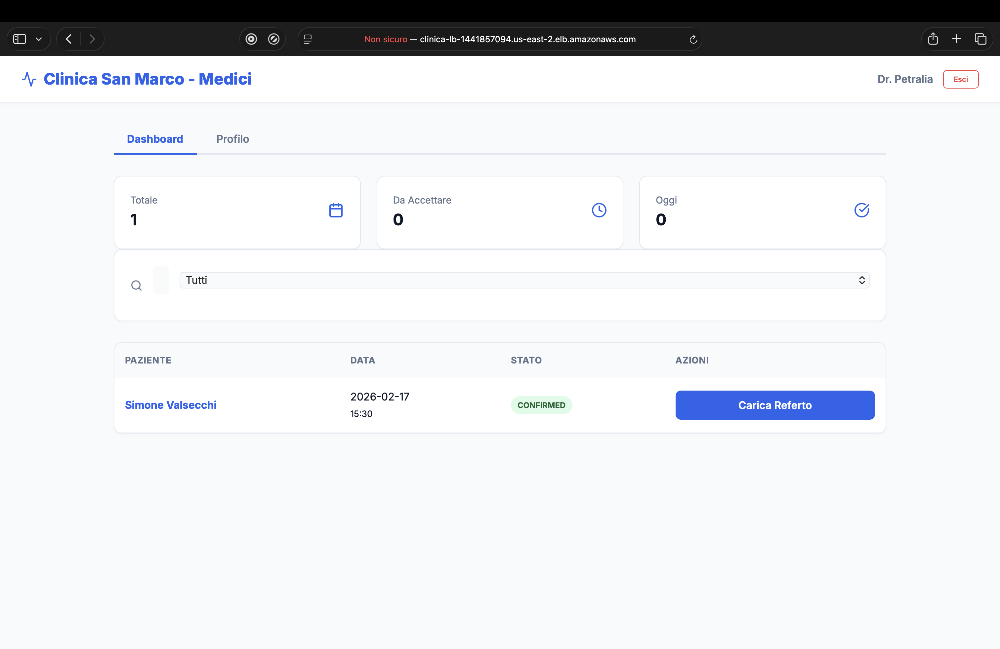
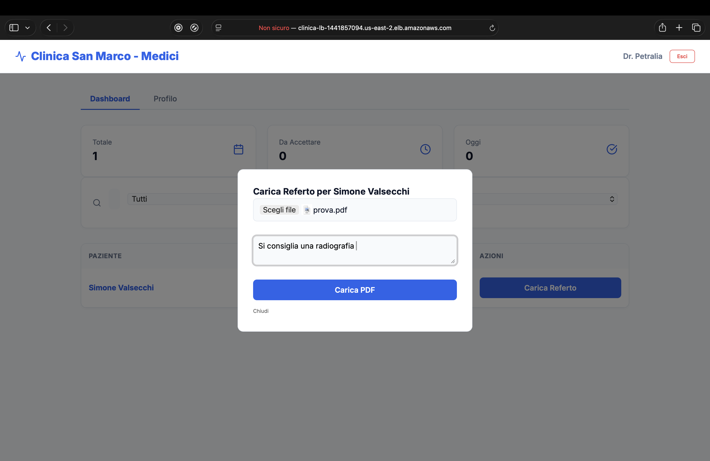
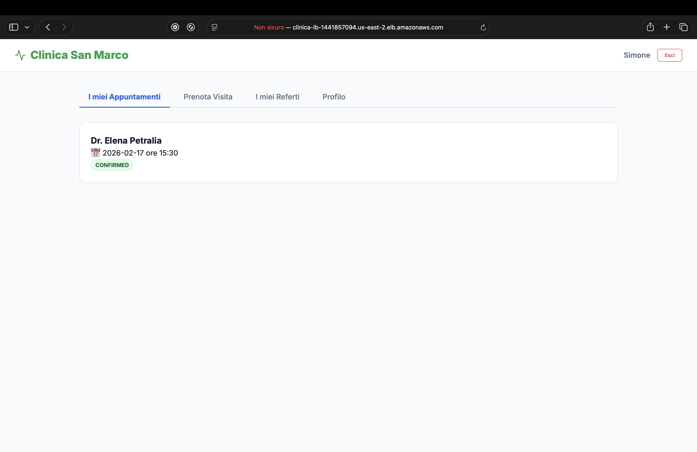
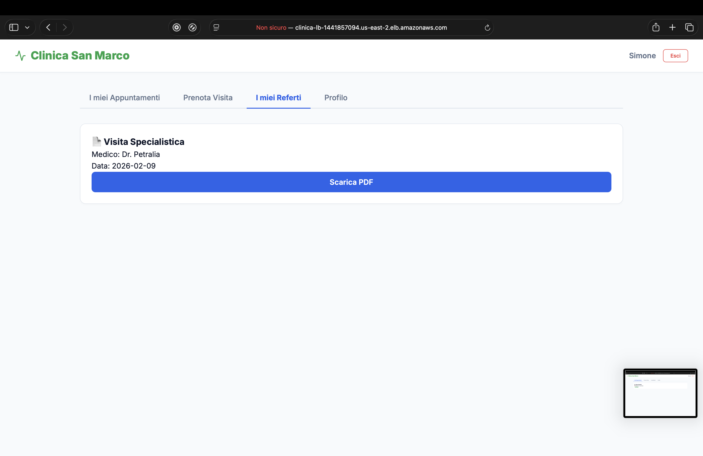

# Clinica System - Cloud Native Healthcare Platform

## 📖 Descrizione
Clinica System è una piattaforma per la gestione di prenotazioni mediche e referti digitali, progettata con un'architettura **Cloud-Native** su AWS. Il sistema garantisce scalabilità, sicurezza e alta disponibilità grazie all'orchestrazione containerizzata e a una pipeline di deployment automatizzata.

---

## 📸 Demo del Sistema (Live Walkthrough)

Di seguito viene illustrato il flusso completo ("User Journey") di utilizzo della piattaforma.

### 1. Home Page
L'utente atterra sulla landing page pubblica, caratterizzata da un design moderno e responsive.

<p align="center">
  
</p>

### 2. Dashboard Iniziale
Al primo accesso, le dashboard riflettono lo stato "vuoto" del database, confermando la corretta creazione dell'utenza.

<p align="center">
  
  
</p>

### 3. Prenotazione Visita
Il paziente seleziona la specializzazione e il medico. Il sistema mostra gli slot disponibili in tempo reale.

<p align="center">
  
</p>


### 4. Gestione Medico & Conferma
Il medico visualizza la nuova richiesta nella dashboard. Accettandola, lo stato passa a `CONFIRMED`.

<p align="center">
  
</p>

### 5. Upload & Refertazione
A visita conclusa, il medico carica il referto PDF su S3 tramite l'apposita interfaccia sicura.

<p align="center">
  
</p>

### 6. Consultazione & Download (Lato Paziente)
Il paziente vede l'appuntamento aggiornato nella sua dashboard e riceve la notifica di disponibilità del referto.

<p align="center">
  
</p>


Infine, può scaricare il documento originale.

<p align="center">
  
</p>

---

## 🛠️ DevOps & CI/CD

Il progetto implementa una pipeline di deployment completamente automatizzata utilizzando **GitHub Actions**.

### Struttura del Repository e Sicurezza
Il codice è organizzato in monorepo. Le credenziali sensibili (AWS Keys, ECR URI) sono gestite tramite **GitHub Secrets** e non sono mai esposte nel codice.


### Workflow di Deployment
Ad ogni push sul branch `main`, la pipeline esegue il build delle immagini Docker, il login su Amazon ECR e l'aggiornamento del servizio ECS Fargate.


---

## 🏗️ Architettura Tecnologica
Il progetto adotta un approccio **Ibrido** per il deployment:
- **Infrastructure as Code (IaC):** Provisioning gestito tramite **Terraform**.
- **CI/CD Pipeline:** Automazione del rilascio tramite **GitHub Actions**.

### Stack
* **Frontend:** React.js (Containerizzato)
* **Backend:** Python FastAPI (Containerizzato con Boto3)
* **Database:** Amazon DynamoDB (Single Table Design)
* **Storage:** Amazon S3 (Referti PDF)
* **Compute:** Amazon ECS su Fargate (Serverless Containers)
* **Networking:** Application Load Balancer (ALB)
* **Sicurezza:** IAM Roles, Security Groups, JWT Authentication

## 🚀 Guida all'Installazione (Locale)

### Prerequisiti
* Terraform >= 1.0
* Docker Desktop
* AWS CLI configurata

### 1. Provisioning Infrastruttura
```bash
cd terraform
terraform init
terraform apply -auto-approve